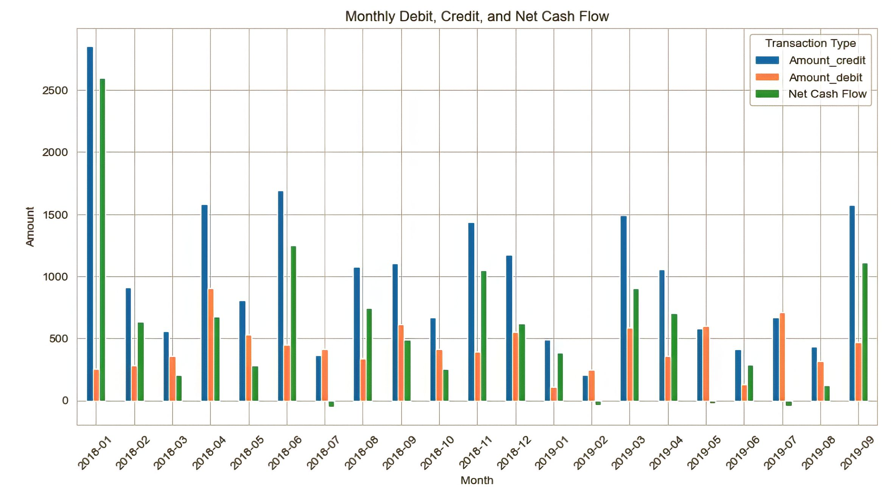
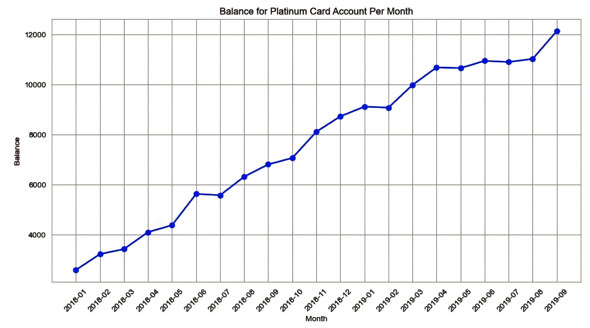
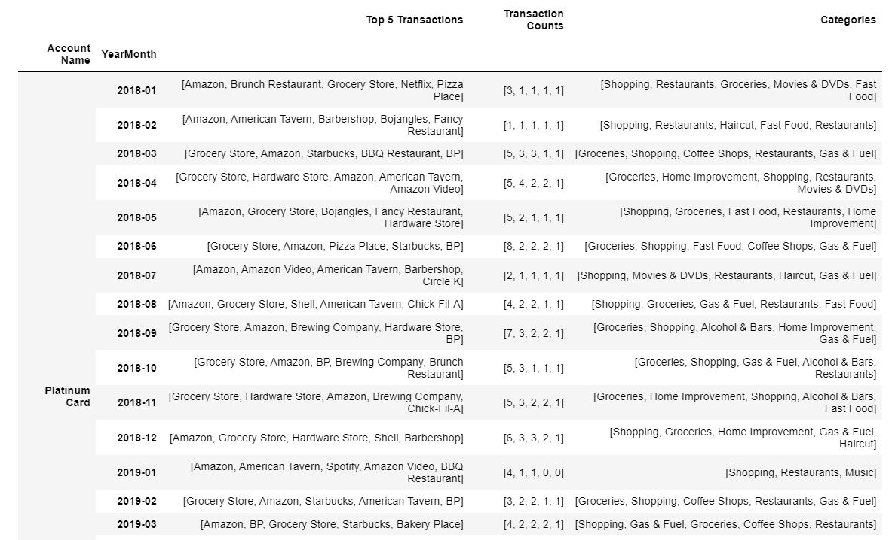

## Hybrid Credit Project

#### Introduction
Welcome to the Hybrid Credit project! This is a project dedicated to advancing financial inclusion for immigrants in the UK by harnessing the power of data and machine learning to reshape the financial landscape and provide fair access to credit opportunities.

#### Objectives

The objectives of Hybrid Credit are to provide accurate and reliable credit scores, assess creditworthiness, and offer suitable credit options to immigrants navigating the complex landscape of the UK's financial services.

#### My Role

I am actively engaged with Hybrid Credit, playing an important role in driving this mission forward. With a strong foundation in data analytics and machine learning, I leverage my skills to explore individual financial health. My key contributions include:

- Analyzing spending and income patterns and transaction categories to gain deep insights into financial behaviors.
- Translating these insights into actionable recommendations, including the development of credit scoring systems to enhance creditworthiness for immigrants.
- Collaborating with a dynamic team to create advanced machine learning models capable of establishing foundational credit scores, assessing creditworthiness, and generating detailed reports from the analysis of immigrants' financial history.
- Focusing on the bigger picture— contributing to a more equitable financial landscape and ultimately improving the financial well-being of immigrants.

I am passionate about making a significant impact on immigrant financial inclusion, and I take pride in being part of a project that promotes a more inclusive society.

#### Project Highlights

Here are some project highlights and snapshots that showcase my work in action:

1. **Net Cash Flow Analysis** - I conducted this analysis to assess the historical net cash flow patterns of various accounts, playing a vital role in understanding financial prudence and individuals' capacity to meet financial obligations. This analysis, which visualized monthly debit and credit transactions, aimed to tailor financial services to unique user account circumstances. For instance, as seen below, the consistently positive net cash flow of the Platinum Card account indicated strong financial management skills and stability, highlighting the significance of 'Net Cash Flow' in creating credit scores and assessing creditworthiness, particularly for immigrants in the UK, as it provides valuable insights into a person's financial discipline: 
   
2. **Balance Trends Analysis** - I conducted a comprehensive analysis of balance trends to shed light on the financial behaviour of account holders and the capacity to meet financial obligations promptly. This analysis is crucial in evaluating the creditworthiness of immigrants in the UK, as a stable and consistently positive balance is a key indicator of financial reliability, serving as a valuable contributor to the determining features in  credit scoring process. The Platinum Card's balance trend shows a progressive pattern, indicating responsible financial behavior. A consistently positive balance suggests lower credit risk, highlighting financial responsibility: 
   
3. **Spending Patterns and Categorization Analysis** - I investigated the spending patterns and categories to identify key areas where account holders typically allocate their expenses. Understanding this from an immigrants foreign financial history informs the development of credit scoring features, a crucial aspect in assessing the creditworthiness of immigrants in the UK. For the Platinum Card account, top expenditure categories include shopping, groceries, coffee, restaurants, home improvement, movies & DVDs, fast food, gas & fuel, alcohol, and occasional expenses like haircuts and electronics. This well-rounded spending profile reflects responsible spending on necessities and leisure activities, indicating a balanced financial approach and positively contributing to their overall financial reliability and creditworthiness assessment: 

#### Conclusion

The Hybrid Credit project represents a meaningful journey in reshaping financial inclusion for immigrants in the UK. I'm proud to have played a crucial role in leveraging data analysis and machine learning to drive change and improve the financial well-being of immigrants. Our collaborative efforts are focused on creating a more equitable financial landscape, and we're excited about the positive impact we're making. 
